# Setup a function that executes SAP HANA SQL binary  
With the help of this repository you can create an Azure Function App that can execute an SQL statement on a SAP HANA Datebase. The Function will receive an HTTP request with the SQL statement, then run the statement using hdbsql binary against the HANA DB and finally return the result.

The setup process described here is based on the execution on a Linux VM with Ubuntu 22.04.
The VM is running in a subnet that has access to the HANA DB. 
With that we can test the function locally before pushing to Azure. 

See also the [Quickstart: Create a Python function in Azure from the command line](https://learn.microsoft.com/en-us/azure/azure-functions/create-first-function-cli-python?tabs=linux%2Cbash%2Cazure-cli&pivots=python-mode-decorators)

# Download this Repository

- Login to the VM and clone this repository:

    `git clone https://github.com/mimergel/saphanasqlfunction.git`

<br>

# Integrate the hdbsql binary 

- You can download the hdbsql here: [SAP Software Center](https://me.sap.com/softwarecenter).
- It's part of the package: SAP HANA CLIENT 2.0.
- In order to uncompress the package you'll also need to download SAPCAR binary.
- Copy the hdbsql binary into this subdirectory:

    `cd ~/saphanasqlfunction/saphanasql/hdbclient/`

- When you have copied the hdbsql in here, make sure to set execute permissions: 

    ```
    cd ~/saphanasqlfunction/saphanasql/hdbclient
    chmod 555 hdbsql
    ls -l
    total 33100
    -r-xr-xr-x 1 azureadm azureadm 33889680 Apr 20  2023 hdbsql
    -rw-rw-r-- 1 azureadm azureadm      102 Nov 10 19:11 hdbsql.txt
    ```

<br>

# Configure local settings 

- Configure local settings to match your HANA DB parameters:

    ```
    cd ~/saphanasqlfunction
    vi local.settings.json
    ```

    ```
    {
    "IsEncrypted": false,
    "Values": {
        "FUNCTIONS_WORKER_RUNTIME": "python",
        "AzureWebJobsStorage": "",
        "DB_USER": "FLIGHTDEMO",
        "DB_USER_SECRET": "set your password",
        "SID": "HDB",
        "TARGETDB" :"saphanadb.contoso.com:30013"
        }
    }

    ```

<br>


# Test the Function App locally

- Run the following command to start your function app:

    ```
    cd ~/saphanasqlfunction
    func start
    ```

- The runtime will output the URL for the HTTP functions, on which we will test the function. 

    ```
    ~/saphanasqlfunction$ func start
    Found Python version 3.10.13 (python3).

    Azure Functions Core Tools
    Core Tools Version:       4.0.5198 Commit hash: N/A  (64-bit)
    Function Runtime Version: 4.21.1.20667


    Functions:

            saphanasql: [GET,POST] http://localhost:7071/api/saphanasql

    For detailed output, run func with --verbose flag.
    [2023-11-10T19:28:23.656Z] Worker process started and initialized.
    [2023-11-10T19:28:27.866Z] Host lock lease acquired by instance ID '0000000000000000000000003399B9E1'.

    ```

- In a another terminal call the function with an SQL command. Here we are using the SAP flight demo data and have generated the data upfront. The FLIGHTDEMO user has read access. 

    ```
    cd ~/saphanasqlfunction
    cat test.sql | curl -X POST http://localhost:7071/api/saphanasql -H "Content-Type: application/json" --data-binary @-
    ```

- When the user can connect and has read access on the relevant tables a results will be shown:

    ```
    FLDATE,NUM_FLIGHTS
    "20230828",24
    ```

- If it doesn't work yet you can check in the first terminal windows for errors. Increase the verbosity if needed.

- To stop testing, use Ctrl-C in the terminal.


<br>


# Create the Function App in Azure

- Create the Function App in the Azure Portal:

    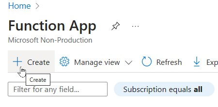

    ---

    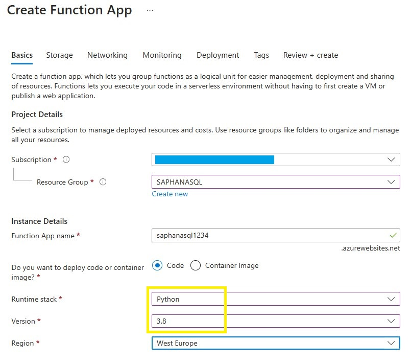

    Note: The function currently only works with Python 3.8. Choose an unsued Function App name.

    ---

    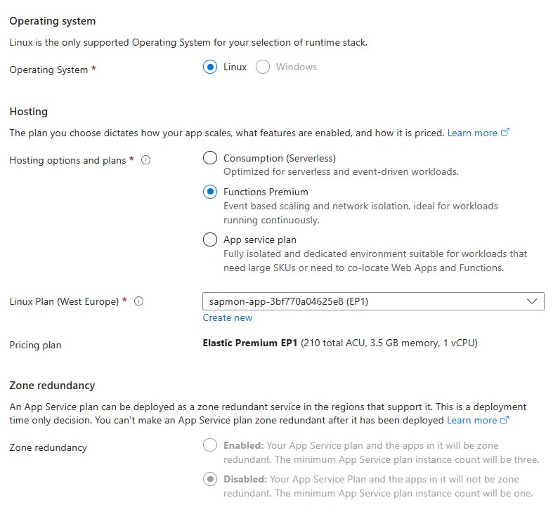

    ---

    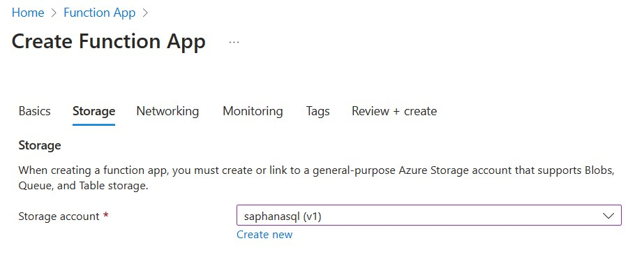

    Note: You can use an existing storage account if one is available. 

    ---

    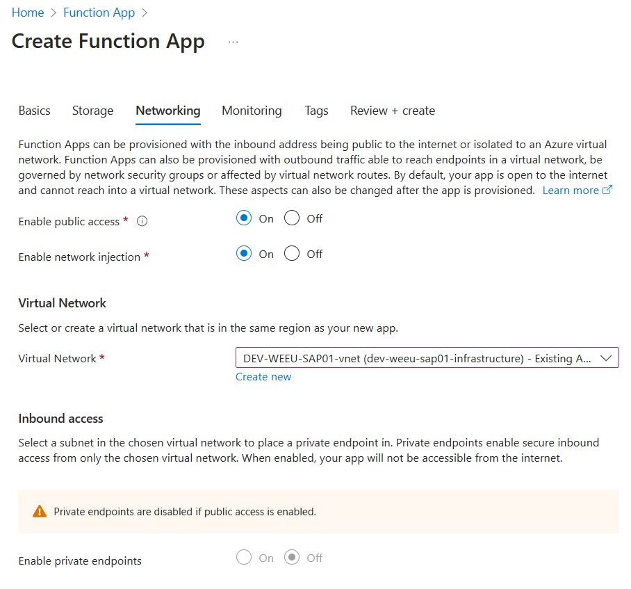

    Note: Enable `Network injection` into a subnet that has access to the SAP HANA DB

    ---

    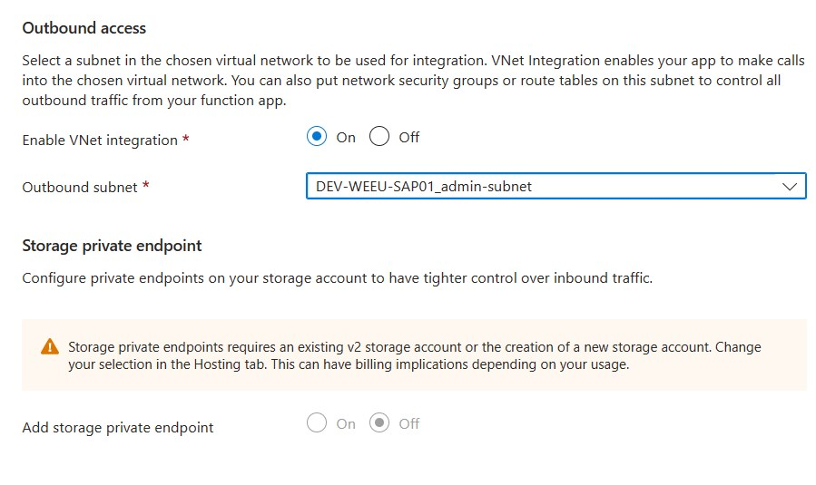

    ---

    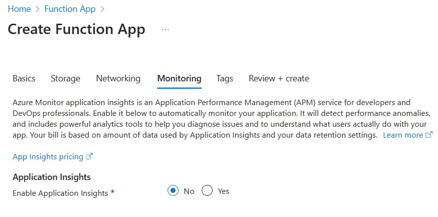


<br>

# Publish the Function App

- On the VM login to Azure:

    ```
    az login
    ```

- Publish the Functions App:

    ```
    func azure functionapp publish [your function app name]
    ```


<br>

# Set required Application Environment

- Set the following application environment:
    - DB_USER
    - DB_USER_SECRET
    - SID
    - TARGETDB

- Use the same values like on the `local.settings.json`

    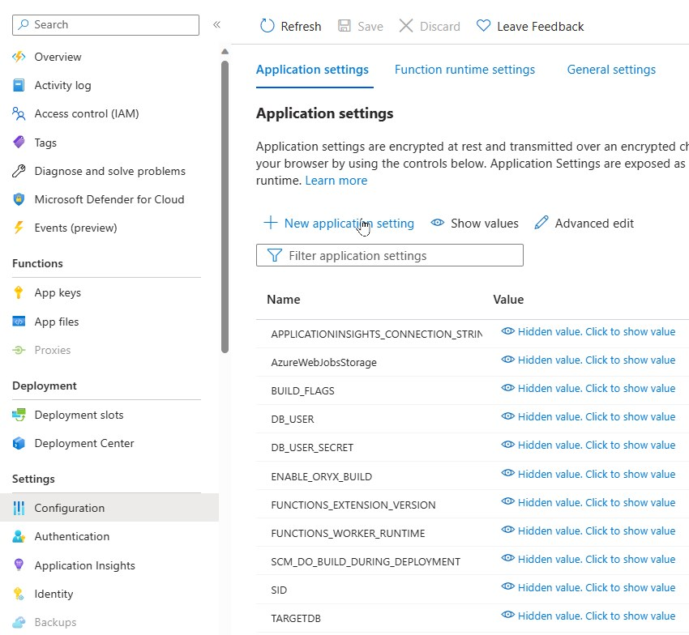


<br>

# Test

- Before using the function we can test in the portal:

    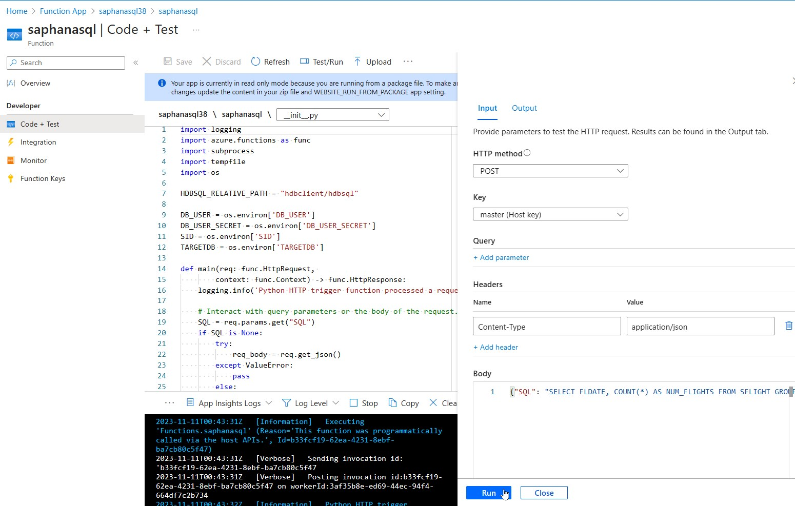

<br>

# Retrieve Function URI and KEY

- Retrieve your URI and Key as shown in the screenshots:

    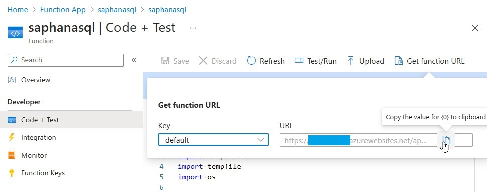

    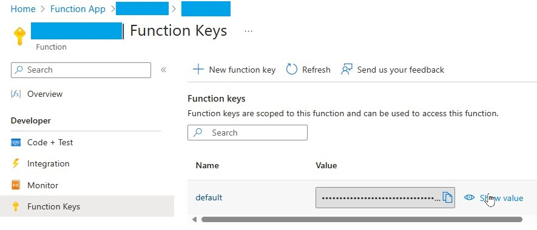

- We'll use the URI and KEY in the Power Automate Flow to call this Function from an HTTP Connector.

<br>

# Using an Azure Key Vault 

It's recommended to store secrets in an Azure Key Vault. 

To achieve this you can create a system assigned identity for the function app and allow this identity to read the relevant secret in a key vault.

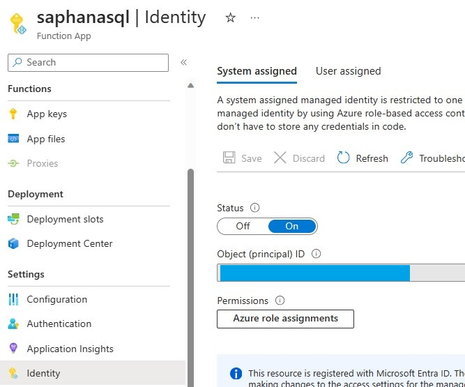

Instead of the password we need to enter the reference to the key vault in the application environment of DB_USER_SECRET. Format:

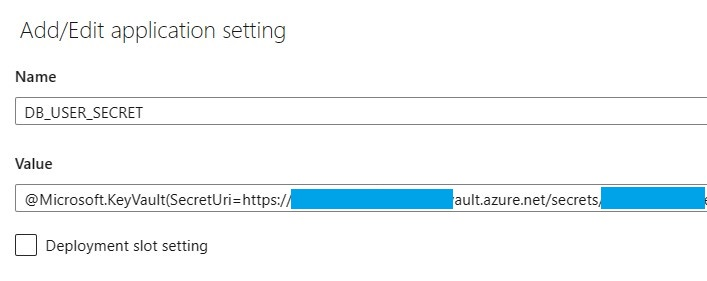

```
@Microsoft.KeyVault(SecretUri=https://yourkeyvaultname.vault.azure.net/secrets/secretname/xxxxsecret_idxxxxxxxxxxxxxxxxxx)
```


<br>

## Disclaimer

THE CONTENT OF THIS REPOSITORY IS PROVIDED AS IS WITHOUT WARRANTY OF ANY KIND, EITHER EXPRESS OR IMPLIED, INCLUDING ANY IMPLIED WARRANTIES OF FITNESS FOR A PARTICULAR PURPOSE, MERCHANTABILITY, OR NON-INFRINGEMENT.